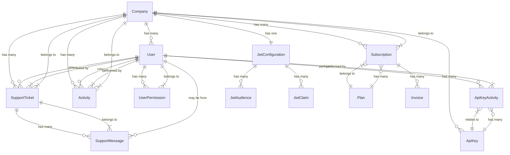

# Documentação de Requisitos Funcionais para Portal de Administração de MicroSaaS

## 1. Introdução

Este documento apresenta os requisitos funcionais para o desenvolvimento de uma aplicação de administração de MicroSaaS, focada no processo de onboarding e gerenciamento de clientes empresariais. A aplicação permitirá que empresas clientes realizem seu cadastro, gerem suas próprias chaves de API e configurem parâmetros de autenticação JWT.

## 2. Requisitos Funcionais

### 2.1 Onboarding de Clientes

#### RF001 - Cadastro de Empresa
- O sistema deve permitir o cadastro de novas empresas clientes
- Dados necessários para cadastro:
  - Nome da empresa
  - CNPJ
  - Endereço
  - Telefone de contato
  - E-mail corporativo
  - Nome do responsável
  - Cargo do responsável

#### RF002 - Verificação de Cadastro
- O sistema deve validar as informações fornecidas durante o cadastro
- Deve enviar um e-mail de confirmação para o e-mail corporativo cadastrado
- Deve validar o CNPJ junto aos órgãos oficiais

#### RF003 - Criação de Conta de Administrador
- Após a verificação, o sistema deve criar automaticamente uma conta de administrador
- Deve enviar as credenciais de acesso para o e-mail do responsável
- Deve forçar a troca de senha no primeiro acesso

### 2.2 Painel Administrativo

#### RF004 - Autenticação no Painel
- O sistema deve permitir o login de usuários cadastrados
- Deve implementar autenticação de dois fatores
- Deve gerenciar sessões ativas com timeout por inatividade

#### RF005 - Dashboard Principal
- O sistema deve apresentar um dashboard com métricas e informações relevantes
- Deve exibir o status atual da conta
- Deve mostrar o consumo de recursos e limites do plano

#### RF006 - Gerenciamento de Usuários
- O sistema deve permitir a criação de usuários adicionais para a empresa
- Deve permitir a atribuição de diferentes níveis de permissão
- Deve permitir a desativação/reativação de usuários

### 2.3 Gestão de API Keys

#### RF007 - Geração de API Keys
- O sistema deve permitir a geração de novas chaves de API
- Deve possibilitar a definição do escopo de acesso da chave
- Deve possibilitar a definição de data de expiração da chave

#### RF008 - Listagem e Gerenciamento de API Keys
- O sistema deve listar todas as chaves de API ativas e inativas
- Deve permitir a revogação/desativação de chaves existentes
- Deve exibir informações sobre o uso de cada chave

#### RF009 - Histórico de Atividades com API Keys
- O sistema deve registrar e exibir o histórico de atividades relacionadas às chaves
- Deve mostrar quem gerou, revogou ou modificou cada chave
- Deve permitir filtrar o histórico por período, usuário ou ação

### 2.4 Configuração de JWT

#### RF010 - Configuração de Audience
- O sistema deve permitir o cadastro e gerenciamento de audiences para tokens JWT
- Deve validar os formatos e estruturas dos audiences informados
- Deve permitir múltiplas configurações de audience

#### RF011 - Gerenciamento de Parâmetros JWT
- O sistema deve permitir a configuração de parâmetros adicionais do JWT
- Deve permitir definir a duração de validade dos tokens
- Deve permitir personalizar claims adicionais

#### RF012 - Ambiente de Testes para JWT
- O sistema deve fornecer um ambiente para testes de tokens JWT
- Deve permitir verificar se um token é válido com base nas configurações atuais
- Deve apresentar informações detalhadas sobre a estrutura do token

### 2.5 Faturamento e Planos

#### RF013 - Visualização de Plano e Faturamento
- O sistema deve exibir informações sobre o plano contratado
- Deve mostrar o histórico de faturas
- Deve permitir o download de comprovantes e notas fiscais

#### RF014 - Mudança de Plano
- O sistema deve permitir a solicitação de mudança de plano
- Deve exibir comparativo entre planos disponíveis
- Deve informar sobre impacto da mudança nos recursos atuais

### 2.6 Suporte e Documentação

#### RF015 - Acesso à Documentação
- O sistema deve disponibilizar documentação técnica completa
- Deve fornecer exemplos de uso das APIs
- Deve apresentar guias de integração com diferentes linguagens

#### RF016 - Suporte Técnico
- O sistema deve permitir a abertura de tickets de suporte
- Deve exibir o histórico de tickets anteriores
- Deve fornecer um chat para comunicação com a equipe de suporte

## 3. Mockups do Portal

### Tela de Login

```
+-------------------------------------------+
|                                           |
|              Logo MicroSaaS               |
|                                           |
|   +-----------------------------------+   |
|   |           E-mail                  |   |
|   +-----------------------------------+   |
|                                           |
|   +-----------------------------------+   |
|   |           Senha                   |   |
|   +-----------------------------------+   |
|                                           |
|   [  Esqueci minha senha  ]               |
|                                           |
|   +-----------------------------------+   |
|   |            ENTRAR                 |   |
|   +-----------------------------------+   |
|                                           |
|   Não tem uma conta?                      |
|   [  Registre sua empresa  ]              |
|                                           |
+-------------------------------------------+
```

### Tela de Cadastro de Empresa

```
+---------------------------------------------------------------------------+
|                                                                           |
|                             Logo MicroSaaS                                |
|                                                                           |
|   CADASTRO DE EMPRESA                                                     |
|                                                                           |
|   +-------------------------------------------------------------------+   |
|   |     Nome da Empresa                                               |   |
|   +-------------------------------------------------------------------+   |
|                                                                           |
|   +-------------------------------------------------------------------+   |
|   |     CNPJ                                                          |   |
|   +-------------------------------------------------------------------+   |
|                                                                           |
|   +-------------------------------------------------------------------+   |
|   |     Endereço                                                      |   |
|   +-------------------------------------------------------------------+   |
|                                                                           |
|   +-------------------------------------------------------------------+   |
|   |     Telefone                                                      |   |
|   +-------------------------------------------------------------------+   |
|                                                                           |
|   +-------------------------------------------------------------------+   |
|   |     E-mail Corporativo                                            |   |
|   +-------------------------------------------------------------------+   |
|                                                                           |
|   DADOS DO RESPONSÁVEL                                                    |
|                                                                           |
|   +-------------------------------------------------------------------+   |
|   |     Nome Completo                                                 |   |
|   +-------------------------------------------------------------------+   |
|                                                                           |
|   +-------------------------------------------------------------------+   |
|   |     Cargo                                                         |   |
|   +-------------------------------------------------------------------+   |
|                                                                           |
|   +-------------------------------------------------------------------+   |
|   |     E-mail                                                        |   |
|   +-------------------------------------------------------------------+   |
|                                                                           |
|   [ ] Aceito os termos de uso                                             |
|                                                                           |
|   +-------------------------------------------------------------------+   |
|   |                          CADASTRAR                                |   |
|   +-------------------------------------------------------------------+   |
|                                                                           |
+---------------------------------------------------------------------------+
```

### Dashboard Principal

```
+---------------------------------------------------------------------------+
|  Logo                                                                     |
|  +-------+                                                         [User] |
+---------------------+-----------------------------------------------------+
|                     |                                                     |
|  [Dashboard]        |                                                     |
|  [Usuários]         |                                                     |
|  [API Keys]         |        Bem-vindo à Administração MicroSaaS          |
|  [JWT Config]       |                                                     |
|  [Faturamento]      |  STATUS DA CONTA                                    |
|  [Suporte]          |  +-------------------------------+                  |
|                     |  |                               |                  |
|                     |  |   Plano Atual: Enterprise     |                  |
|                     |  |   Status: Ativo               |                  |
|                     |  |   Próx. Faturamento: 15/05/25 |                  |
|                     |  |                               |                  |
|                     |  +-------------------------------+                  |
|                     |                                                     |
|                     |  CONSUMO DE RECURSOS                                |
|                     |  +-------------------------------+                  |
|                     |  |                               |                  |
|                     |  |   Chamadas API: 78%           |                  |
|                     |  |   Armazenamento: 45%          |                  |
|                     |  |   Usuários: 35%               |                  |
|                     |  |                               |                  |
|                     |  +-------------------------------+                  |
|                     |                                                     |
|                     |  ATIVIDADES RECENTES                                |
|                     |  +-------------------------------+                  |
|                     |  |                               |                  |
|                     |  | • Nova API Key criada         |                  |
|                     |  | • Config JWT atualizada       |                  |
|                     |  | • Novo usuário adicionado     |                  |
|                     |  |                               |                  |
|                     |  +-------------------------------+                  |
|                     |                                                     |
+------------------------------------+--------------------------------------+
```

### Gerenciamento de API Keys

```
+---------------------------------------------------------------------------+
|  Logo                                                                     |
|  +-------+                                                         [User] |
+--+-------+---------------------------------------------------------------+
|                                    |                                      |
|  [Dashboard]                       |                                      |
|  [Usuários]                        |  Gerenciamento de API Keys           |
|  [API Keys] ◄                      |                                      |
|  [JWT Config]                      |  [+ Nova API Key]                    |
|  [Faturamento]                     |                                      |
|  [Suporte]                         |  CHAVES ATIVAS                       |
|                                    |  +-------------------------------+   |
|                                    |  |                               |   |
|                                    |  | Nome: Produção                |   |
|                                    |  | Criada em: 10/03/2025         |   |
|                                    |  | Expira em: Não expira         |   |
|                                    |  | Escopo: Total                 |   |
|                                    |  | [Visualizar] [Revogar]        |   |
|                                    |  |                               |   |
|                                    |  +-------------------------------+   |
|                                    |                                      |
|                                    |  +-------------------------------+   |
|                                    |  |                               |   |
|                                    |  | Nome: Homologação             |   |
|                                    |  | Criada em: 15/02/2025         |   |
|                                    |  | Expira em: 15/05/2025         |   |
|                                    |  | Escopo: Somente leitura       |   |
|                                    |  | [Visualizar] [Revogar]        |   |
|                                    |  |                               |   |
|                                    |  +-------------------------------+   |
|                                    |                                      |
|                                    |  CHAVES REVOGADAS                    |
|                                    |  +-------------------------------+   |
|                                    |  |                               |   |
|                                    |  | Nome: Desenvolvimento         |   |
|                                    |  | Criada em: 01/01/2025         |   |
|                                    |  | Revogada em: 01/03/2025       |   |
|                                    |  | Escopo: Desenvolvimento       |   |
|                                    |  | [Visualizar] [Restaurar]      |   |
|                                    |  |                               |   |
|                                    |  +-------------------------------+   |
|                                    |                                      |
+------------------------------------+--------------------------------------+
```

### Configuração de JWT

```
+---------------------------------------------------------------------------+
|  Logo                                                                     |
|  +-------+                                                         [User] |
+--+-------+---------------------------------------------------------------+
|                                    |                                      |
|  [Dashboard]                       |                                      |
|  [Usuários]                        |  Configuração de JWT                 |
|  [API Keys]                        |                                      |
|  [JWT Config] ◄                    |  AUDIENCES                           |
|  [Faturamento]                     |                                      |
|  [Suporte]                         |  [+ Novo Audience]                   |
|                                    |                                      |
|                                    |  +-------------------------------+   |
|                                    |  |                               |   |
|                                    |  | Audience: api.minhaempresa.com|   |
|                                    |  | Criado em: 10/03/2025         |   |
|                                    |  | Status: Ativo                 |   |
|                                    |  | [Editar] [Desativar]          |   |
|                                    |  |                               |   |
|                                    |  +-------------------------------+   |
|                                    |                                      |
|                                    |  +-------------------------------+   |
|                                    |  |                               |   |
|                                    |  | Audience: app.minhaempresa.com|   |
|                                    |  | Criado em: 15/02/2025         |   |
|                                    |  | Status: Ativo                 |   |
|                                    |  | [Editar] [Desativar]          |   |
|                                    |  |                               |   |
|                                    |  +-------------------------------+   |
|                                    |                                      |
|                                    |  CONFIGURAÇÕES DE TOKEN              |
|                                    |                                      |
|                                    |  +-------------------------------+   |
|                                    |  | Duração do token: 60 minutos  |   |
|                                    |  | [Alterar]                     |   |
|                                    |  +-------------------------------+   |
|                                    |                                      |
|                                    |  +-------------------------------+   |
|                                    |  | Claims personalizados         |   |
|                                    |  | [Configurar]                  |   |
|                                    |  +-------------------------------+   |
|                                    |                                      |
|                                    |  AMBIENTE DE TESTES                  |
|                                    |  [Testar Configurações]              |
|                                    |                                      |
+------------------------------------+--------------------------------------+
```

### Criação de Nova API Key

```
+-------------------------------------------+
|                                           |
|              Nova API Key                 |
|                                           |
|   +-----------------------------------+   |
|   |     Nome da Chave                |   |
|   +-----------------------------------+   |
|                                           |
|   Escopo de Acesso                        |
|   ( ) Total                               |
|   ( ) Somente leitura                     |
|   ( ) Personalizado                       |
|                                           |
|   Expiração                               |
|   ( ) Sem expiração                       |
|   ( ) Personalizada                       |
|                                           |
|   +-----------------------------------+   |
|   |     Data de expiração            |   |
|   +-----------------------------------+   |
|                                           |
|   +-----------------------------------+   |
|   |          GERAR CHAVE              |   |
|   +-----------------------------------+   |
|                                           |
|   [   Cancelar   ]                        |
|                                           |
+-------------------------------------------+
```

### Visualização de Chave Gerada

```
+-------------------------------------------+
|                                           |
|             Chave Gerada                  |
|                                           |
|   ⚠️ Atenção! Esta é a única vez que a   |
|   chave será exibida por completo.        |
|   Certifique-se de copiar antes de sair.  |
|                                           |
|   +-----------------------------------+   |
|   | s7d6f5g4h3j2k1l0p9o8i7u6y5t4r3e2 |   |
|   +-----------------------------------+   |
|                                           |
|   [   Copiar   ]                          |
|                                           |
|   Detalhes da Chave:                      |
|   Nome: Produção                          |
|   Escopo: Total                           |
|   Criada em: 03/04/2025 00:55             |
|   Expira em: Não expira                   |
|                                           |
|   +-----------------------------------+   |
|   |            CONCLUIR               |   |
|   +-----------------------------------+   |
|                                           |
+-------------------------------------------+
```

## 4. Considerações Técnicas

### 4.1 Padrões de Desenvolvimento
- Seguir as convenções de nomenclatura .NET
- Implementar arquitetura em camadas
- Utilizar injeção de dependência para manter baixo acoplamento
- Desenvolver testes unitários para garantir a qualidade do código

### 4.2 Segurança
- Implementar autenticação OAuth 2.0
- Armazenar senhas utilizando hashing com salt
- Utilizar HTTPS para todas as comunicações
- Implementar proteção contra ataques comuns (CSRF, XSS, SQL Injection)
- Realizar sanitização de inputs

### 4.3 Desempenho
- Implementar cache para operações frequentes
- Otimizar consultas ao banco de dados
- Utilizar paginação para listagens extensas
- Considerar o uso de CDN para recursos estáticos

## 5. Próximos Passos

Para avançar com o desenvolvimento deste projeto, recomenda-se:

1. Validar os requisitos funcionais e mockups apresentados
2. Definir os requisitos não-funcionais (desempenho, escalabilidade, etc.)
3. Elaborar o modelo de dados
4. Definir a arquitetura detalhada da solução
5. Criar um cronograma de desenvolvimento
6. Implementar um ambiente de CI/CD

## 6. Estratégias de Implementação Multitenant

Este sistema será implementado como uma solução multitenant, permitindo que várias empresas (tenants) utilizem a mesma infraestrutura compartilhada de maneira isolada e segura. Abaixo, apresentamos duas possíveis estratégias de implementação multitenant.

### 6.1 Abordagem com Company como Tenant

Nesta abordagem, a entidade Company representa diretamente um tenant no sistema, tornando o Company.Id equivalente ao Tenant ID.

#### Vantagens:
- Simplicidade no modelo de dados
- Mapeamento direto entre empresa e tenant
- Menor complexidade nas consultas ao banco de dados
- Implementação mais rápida e direta

#### Exemplo de Implementação:

```csharp
// Contexto de tenant usando Company como tenant
public class TenantContext
{
    private readonly IHttpContextAccessor _httpContextAccessor;
    
    public TenantContext(IHttpContextAccessor httpContextAccessor)
    {
        _httpContextAccessor = httpContextAccessor;
    }
    
    public Guid GetCurrentTenantId()
    {
        // Extrair tenant das claims do usuário autenticado
        var companyId = _httpContextAccessor.HttpContext.User
            .FindFirst("CompanyId")?.Value;
            
        return Guid.Parse(companyId);
    }
}

// Repositório com filtragem por Company/Tenant
public class ApiKeyRepository : IApiKeyRepository
{
    private readonly ITenantContext _tenantContext;
    private readonly AppDbContext _dbContext;
    
    public ApiKeyRepository(ITenantContext tenantContext, AppDbContext dbContext)
    {
        _tenantContext = tenantContext;
        _dbContext = dbContext;
    }
    
    public async Task<IEnumerable<ApiKey>> GetAllAsync()
    {
        var tenantId = _tenantContext.GetCurrentTenantId();
        return await _dbContext.ApiKeys
            .Where(k => k.CompanyId == tenantId)
            .ToListAsync();
    }
}
```

### 6.2 Abordagem com Entidade Tenant Separada

Nesta abordagem, criamos uma entidade Tenant separada, permitindo um relacionamento mais flexível onde um tenant pode ter várias empresas.

#### Vantagens:
- Flexibilidade para grupos empresariais sob um mesmo tenant
- Configurações e limites no nível de tenant, não apenas por empresa
- Facilitação para migração de empresas entre tenants quando necessário
- Gestão centralizada de múltiplos tenants

#### Exemplo de Implementação:

```csharp
// Entidade Tenant
public class Tenant
{
    public Guid Id { get; set; }
    public string Nome { get; set; }
    public string Dominio { get; set; }
    public bool Ativo { get; set; }
    
    // Relacionamentos
    public virtual ICollection<Company> Empresas { get; set; }
}

// Entidade Company com referência ao Tenant
public class Company
{
    public Guid Id { get; set; }
    public Guid TenantId { get; set; } // Referência ao tenant
    public string Nome { get; set; }
    // Outras propriedades...
    
    // Relacionamentos
    public virtual Tenant Tenant { get; set; }
    public virtual ICollection<User> Usuarios { get; set; }
}

// Contexto de tenant com entidade separada
public class TenantContext : ITenantContext
{
    private readonly IHttpContextAccessor _httpContextAccessor;
    private readonly ApplicationDbContext _dbContext;
    
    public TenantContext(IHttpContextAccessor httpContextAccessor, ApplicationDbContext dbContext)
    {
        _httpContextAccessor = httpContextAccessor;
        _dbContext = dbContext;
    }
    
    public Guid GetCurrentTenantId()
    {
        // Obter tenant do token ou header
        var tenantClaim = _httpContextAccessor.HttpContext?.User
            .FindFirst("TenantId");
            
        if (tenantClaim != null)
        {
            return Guid.Parse(tenantClaim.Value);
        }
        
        return Guid.Empty;
    }
    
    public Tenant GetCurrentTenant()
    {
        var tenantId = GetCurrentTenantId();
        return _dbContext.Tenants.FirstOrDefault(t => t.Id == tenantId);
    }
}
```

### 6.3 Decisão de Arquitetura

Para a primeira versão deste sistema, adotaremos a abordagem mais simples, usando Company como Tenant (6.1), considerando que:

1. Cada empresa cliente usará o sistema de forma independente
2. Não há necessidade inicial de agrupar empresas sob um mesmo tenant
3. Busca-se maior simplicidade de implementação e manutenção
4. As consultas ao banco de dados serão mais eficientes

Entretanto, a arquitetura será projetada de forma que uma eventual migração para a abordagem com entidade Tenant separada seja possível no futuro, caso os requisitos de negócio evoluam para essa necessidade.

## 7. Configuração da Injeção de Dependência

Para que as classes de contexto e repositórios funcionem corretamente no ambiente multitenant, é necessário configurar adequadamente o sistema de injeção de dependência (DI).

### 7.1 Registro do HttpContextAccessor

O `HttpContextAccessor` é um componente fundamental para acessar o contexto HTTP atual em classes que não têm acesso direto ao `HttpContext`. Este componente precisa ser registrado no contêiner de DI para que o `TenantContext` possa utilizá-lo:

```csharp
// No método ConfigureServices da classe Startup ou em um Program.cs com .NET 6+
public void ConfigureServices(IServiceCollection services)
{
    // Registra o HttpContextAccessor
    services.AddHttpContextAccessor();
    
    // Restante da configuração...
}
```

Ou para aplicações .NET 6 ou superior usando o builder pattern:

```csharp
// Em Program.cs
var builder = WebApplication.CreateBuilder(args);

// Registra o HttpContextAccessor
builder.Services.AddHttpContextAccessor();

// Restante da configuração...
```

### 7.2 Registro do TenantContext

Após registrar o `HttpContextAccessor`, é necessário registrar o próprio `TenantContext`:

```csharp
// Registro do TenantContext e sua interface
services.AddScoped<ITenantContext, TenantContext>();
```

A escolha do escopo `Scoped` é importante porque:
- O contexto do tenant deve persistir durante toda a requisição HTTP
- Um novo contexto de tenant deve ser criado para cada requisição
- Precisamos manter a consistência de identificação do tenant ao longo de uma única operação

### 7.3 Registro de Serviços Dependentes

Para repositórios e serviços que dependem do `TenantContext`:

```csharp
// Registro de repositórios
services.AddScoped<IApiKeyRepository, ApiKeyRepository>();
services.AddScoped<IUserRepository, UserRepository>();

// Registro de serviços
services.AddScoped<IApiKeyService, ApiKeyService>();
```

### 7.4 Exemplo Completo de Configuração

```csharp
public void ConfigureServices(IServiceCollection services)
{
    // Serviços do ASP.NET Core
    services.AddControllers();
    services.AddHttpContextAccessor();
    
    // Registra o DbContext
    services.AddDbContext<ApplicationDbContext>(options =>
        options.UseSqlServer(Configuration.GetConnectionString("DefaultConnection")));
    
    // Registra serviços de tenant
    services.AddScoped<ITenantContext, TenantContext>();
    
    // Registra repositórios
    services.AddScoped<IApiKeyRepository, ApiKeyRepository>();
    services.AddScoped<ICompanyRepository, CompanyRepository>();
    services.AddScoped<IUserRepository, UserRepository>();
    
    // Registra serviços de negócio
    services.AddScoped<IApiKeyService, ApiKeyService>();
    services.AddScoped<IUserService, UserService>();
    services.AddScoped<IJwtConfigurationService, JwtConfigurationService>();
    
    // Configuração de autenticação e autorização
    services.AddAuthentication(JwtBearerDefaults.AuthenticationScheme)
        .AddJwtBearer(options => {
            // Configuração do JWT...
        });
    
    services.AddAuthorization(options => {
        // Políticas de autorização...
    });
}
```

O sistema de injeção de dependência garantirá que sempre que o `TenantContext` for solicitado, uma instância com o `HttpContextAccessor` adequado será fornecida, permitindo que seu código extraia corretamente o identificador do tenant do contexto HTTP atual.

## 8. Modelo de Dados

Esta seção descreve as principais entidades do sistema, seus atributos e relacionamentos, de acordo com a abordagem escolhida onde Company representa o tenant.

### 8.1 Entidades Principais

#### 8.1.1 Company (Empresa/Tenant)

Representa uma empresa cliente (tenant) no sistema.

| Atributo        | Tipo          | Descrição                                  |
|-----------------|---------------|-------------------------------------------|
| Id              | Guid          | Identificador único da empresa/tenant     |
| Name            | string        | Nome da empresa                           |
| CNPJ            | string        | CNPJ da empresa                           |
| Address         | string        | Endereço completo da empresa              |
| Phone           | string        | Telefone de contato da empresa            |
| Email           | string        | Email corporativo da empresa              |
| Status          | enum          | Status da empresa (Ativo, Inativo)        |
| CreatedAt       | DateTime      | Data de criação do registro               |
| UpdatedAt       | DateTime?     | Data da última atualização                |

**Relacionamentos:**
- Uma Company tem muitos Users (1:N)
- Uma Company tem muitas ApiKeys (1:N)
- Uma Company tem uma JwtConfiguration (1:1)
- Uma Company tem muitas Subscriptions (1:N)
- Uma Company tem muitos SupportTickets (1:N)

#### 8.1.2 User (Usuário)

Representa um usuário do sistema associado a uma empresa.

| Atributo        | Tipo          | Descrição                                  |
|-----------------|---------------|-------------------------------------------|
| Id              | Guid          | Identificador único do usuário             |
| CompanyId       | Guid          | Referência à empresa (FK)                  |
| Name            | string        | Nome completo do usuário                   |
| Email           | string        | Email do usuário                           |
| Password        | string        | Hash da senha do usuário                   |
| Position        | string        | Cargo/função do usuário                    |
| IsAdmin         | bool          | Indica se é um administrador               |
| TwoFactorEnabled| bool          | Indica se 2FA está habilitado              |
| Status          | enum          | Status do usuário (Ativo, Inativo)         |
| LastLogin       | DateTime?     | Data/hora do último login                  |
| CreatedAt       | DateTime      | Data de criação do registro                |
| UpdatedAt       | DateTime?     | Data da última atualização                 |

**Relacionamentos:**
- Um User pertence a uma Company (N:1)
- Um User tem muitas UserPermissions (1:N)
- Um User tem muitas Activities (1:N)
- Um User tem muitos SupportTickets (1:N)

#### 8.1.3 UserPermission (Permissão de Usuário)

Define as permissões específicas atribuídas a um usuário.

| Atributo        | Tipo          | Descrição                                  |
|-----------------|---------------|-------------------------------------------|
| Id              | Guid          | Identificador único da permissão           |
| UserId          | Guid          | Referência ao usuário (FK)                 |
| PermissionType  | enum          | Tipo de permissão                          |
| CreatedAt       | DateTime      | Data de criação do registro                |
| CreatedBy       | Guid          | Usuário que criou a permissão              |

**Relacionamentos:**
- Uma UserPermission pertence a um User (N:1)

#### 8.1.4 ApiKey (Chave de API)

Representa uma chave de API gerada para uma empresa.

| Atributo        | Tipo          | Descrição                                  |
|-----------------|---------------|-------------------------------------------|
| Id              | Guid          | Identificador único da chave               |
| CompanyId       | Guid          | Referência à empresa (FK)                  |
| Name            | string        | Nome/descrição da chave                    |
| Key             | string        | Valor da chave (hash)                      |
| Scope           | enum          | Escopo de acesso da chave                  |
| Status          | enum          | Status da chave (Ativa, Revogada)          |
| CreatedAt       | DateTime      | Data de criação do registro                |
| CreatedBy       | Guid          | Usuário que criou a chave                  |
| ExpiresAt       | DateTime?     | Data de expiração (se houver)              |
| RevokedAt       | DateTime?     | Data de revogação (se revogada)            |
| RevokedBy       | Guid?         | Usuário que revogou a chave                |

**Relacionamentos:**
- Uma ApiKey pertence a uma Company (N:1)
- Uma ApiKey tem muitas ApiKeyActivities (1:N)

#### 8.1.5 ApiKeyActivity (Atividade de Chave de API)

Registra atividades relacionadas às chaves de API.

| Atributo        | Tipo          | Descrição                                  |
|-----------------|---------------|-------------------------------------------|
| Id              | Guid          | Identificador único da atividade           |
| ApiKeyId        | Guid          | Referência à chave de API (FK)             |
| UserId          | Guid          | Usuário que realizou a ação                |
| ActionType      | enum          | Tipo de ação (Criação, Revogação, etc.)    |
| Timestamp       | DateTime      | Data/hora da atividade                     |
| Details         | string        | Detalhes adicionais da atividade           |

**Relacionamentos:**
- Uma ApiKeyActivity pertence a uma ApiKey (N:1)
- Uma ApiKeyActivity pertence a um User (N:1)

#### 8.1.6 JwtConfiguration (Configuração JWT)

Armazena as configurações de JWT para uma empresa.

| Atributo        | Tipo          | Descrição                                  |
|-----------------|---------------|-------------------------------------------|
| Id              | Guid          | Identificador único da configuração        |
| CompanyId       | Guid          | Referência à empresa (FK)                  |
| TokenDuration   | int           | Duração do token em minutos                |
| CreatedAt       | DateTime      | Data de criação do registro                |
| UpdatedAt       | DateTime?     | Data da última atualização                 |
| UpdatedBy       | Guid?         | Usuário que atualizou a configuração       |

**Relacionamentos:**
- Uma JwtConfiguration pertence a uma Company (1:1)
- Uma JwtConfiguration tem muitas JwtAudiences (1:N)
- Uma JwtConfiguration tem muitas JwtClaims (1:N)

#### 8.1.7 JwtAudience (Audience JWT)

Define os audiences válidos para tokens JWT.

| Atributo        | Tipo          | Descrição                                  |
|-----------------|---------------|-------------------------------------------|
| Id              | Guid          | Identificador único do audience            |
| JwtConfigurationId | Guid       | Referência à configuração JWT (FK)         |
| AudienceName    | string        | Nome/URL do audience                       |
| Status          | enum          | Status do audience (Ativo, Inativo)        |
| CreatedAt       | DateTime      | Data de criação do registro                |
| CreatedBy       | Guid          | Usuário que criou o audience               |
| UpdatedAt       | DateTime?     | Data da última atualização                 |
| UpdatedBy       | Guid?         | Usuário que atualizou o audience           |

**Relacionamentos:**
- Uma JwtAudience pertence a uma JwtConfiguration (N:1)

#### 8.1.8 JwtClaim (Claim JWT)

Define claims personalizados para tokens JWT.

| Atributo        | Tipo          | Descrição                                  |
|-----------------|---------------|-------------------------------------------|
| Id              | Guid          | Identificador único do claim               |
| JwtConfigurationId | Guid       | Referência à configuração JWT (FK)         |
| ClaimName       | string        | Nome do claim                              |
| ClaimValue      | string        | Valor do claim                             |
| CreatedAt       | DateTime      | Data de criação do registro                |
| CreatedBy       | Guid          | Usuário que criou o claim                  |

**Relacionamentos:**
- Um JwtClaim pertence a uma JwtConfiguration (N:1)

#### 8.1.9 Subscription (Assinatura)

Representa a assinatura de um plano por uma empresa.

| Atributo        | Tipo          | Descrição                                  |
|-----------------|---------------|-------------------------------------------|
| Id              | Guid          | Identificador único da assinatura          |
| CompanyId       | Guid          | Referência à empresa (FK)                  |
| PlanId          | Guid          | Referência ao plano (FK)                   |
| StartDate       | DateTime      | Data de início da assinatura               |
| EndDate         | DateTime?     | Data de término da assinatura              |
| Status          | enum          | Status da assinatura (Ativa, Cancelada)    |
| CreatedAt       | DateTime      | Data de criação do registro                |
| UpdatedAt       | DateTime?     | Data da última atualização                 |

**Relacionamentos:**
- Uma Subscription pertence a uma Company (N:1)
- Uma Subscription pertence a um Plan (N:1)
- Uma Subscription tem muitas Invoices (1:N)

#### 8.1.10 Plan (Plano)

Define os planos disponíveis no sistema.

| Atributo        | Tipo          | Descrição                                  |
|-----------------|---------------|-------------------------------------------|
| Id              | Guid          | Identificador único do plano               |
| Name            | string        | Nome do plano                              |
| Description     | string        | Descrição detalhada do plano               |
| ApiCallLimit    | int           | Limite de chamadas API                     |
| StorageLimit    | int           | Limite de armazenamento (MB)               |
| UserLimit       | int           | Limite de usuários                         |
| Price           | decimal       | Preço do plano                             |
| BillingCycle    | enum          | Ciclo de cobrança (Mensal, Anual)          |
| IsActive        | bool          | Indica se o plano está ativo               |
| CreatedAt       | DateTime      | Data de criação do registro                |
| UpdatedAt       | DateTime?     | Data da última atualização                 |

**Relacionamentos:**
- Um Plan tem muitas Subscriptions (1:N)

#### 8.1.11 Invoice (Fatura)

Representa as faturas geradas para assinaturas.

| Atributo        | Tipo          | Descrição                                  |
|-----------------|---------------|-------------------------------------------|
| Id              | Guid          | Identificador único da fatura              |
| SubscriptionId  | Guid          | Referência à assinatura (FK)               |
| Amount          | decimal       | Valor da fatura                            |
| IssueDate       | DateTime      | Data de emissão                            |
| DueDate         | DateTime      | Data de vencimento                         |
| Status          | enum          | Status da fatura (Paga, Pendente)          |
| PaymentDate     | DateTime?     | Data de pagamento (se paga)                |
| InvoiceUrl      | string        | URL para download da fatura                |
| CreatedAt       | DateTime      | Data de criação do registro                |
| UpdatedAt       | DateTime?     | Data da última atualização                 |

**Relacionamentos:**
- Uma Invoice pertence a uma Subscription (N:1)

#### 8.1.12 SupportTicket (Ticket de Suporte)

Representa os tickets de suporte abertos pelos usuários.

| Atributo        | Tipo          | Descrição                                  |
|-----------------|---------------|-------------------------------------------|
| Id              | Guid          | Identificador único do ticket              |
| CompanyId       | Guid          | Referência à empresa (FK)                  |
| UserId          | Guid          | Referência ao usuário que abriu (FK)       |
| Title           | string        | Título do ticket                           |
| Description     | string        | Descrição detalhada do problema            |
| Status          | enum          | Status do ticket (Aberto, Fechado)         |
| Priority        | enum          | Prioridade (Baixa, Média, Alta)            |
| CreatedAt       | DateTime      | Data de criação do ticket                  |
| ClosedAt        | DateTime?     | Data de fechamento (se fechado)            |
| ClosedBy        | Guid?         | Usuário que fechou o ticket                |

**Relacionamentos:**
- Um SupportTicket pertence a uma Company (N:1)
- Um SupportTicket pertence a um User (N:1)
- Um SupportTicket tem muitas SupportMessages (1:N)

#### 8.1.13 SupportMessage (Mensagem de Suporte)

Representa as mensagens trocadas em um ticket de suporte.

| Atributo        | Tipo          | Descrição                                  |
|-----------------|---------------|-------------------------------------------|
| Id              | Guid          | Identificador único da mensagem            |
| TicketId        | Guid          | Referência ao ticket (FK)                  |
| UserId          | Guid?         | Referência ao usuário (FK, null se suporte)|
| Message         | string        | Conteúdo da mensagem                       |
| IsFromSupport   | bool          | Indica se a mensagem é da equipe de suporte|
| Timestamp       | DateTime      | Data/hora da mensagem                      |

**Relacionamentos:**
- Uma SupportMessage pertence a um SupportTicket (N:1)
- Uma SupportMessage pode pertencer a um User (N:1 opcional)

#### 8.1.14 Activity (Atividade)

Registra atividades gerais no sistema.

| Atributo        | Tipo          | Descrição                                  |
|-----------------|---------------|-------------------------------------------|
| Id              | Guid          | Identificador único da atividade           |
| UserId          | Guid          | Referência ao usuário (FK)                 |
| CompanyId       | Guid          | Referência à empresa (FK)                  |
| ActivityType    | enum          | Tipo de atividade                          |
| EntityType      | string        | Tipo de entidade relacionada               |
| EntityId        | Guid?         | ID da entidade relacionada                 |
| Details         | string        | Detalhes da atividade                      |
| Timestamp       | DateTime      | Data/hora da atividade                     |

**Relacionamentos:**
- Uma Activity pertence a um User (N:1)
- Uma Activity pertence a uma Company (N:1)

### 8.2 Diagrama de Relacionamento

O diagrama abaixo ilustra os relacionamentos entre as entidades principais do sistema:

