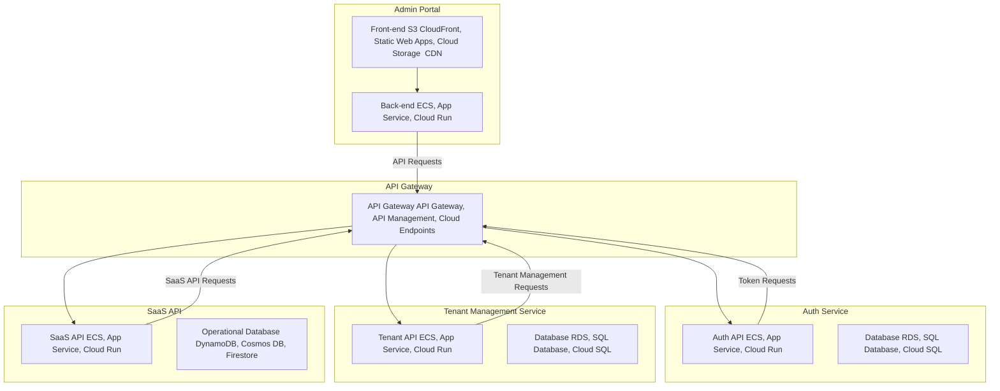

```mermaid

flowchart TD
    subgraph Admin Portal
        A1[Front-end S3 CloudFront, Static Web Apps, Cloud Storage  CDN]
        A2[Back-end ECS, App Service, Cloud Run]
    end
    
    subgraph Auth Service
        B1[Auth API ECS, App Service, Cloud Run]
        B2[Database RDS, SQL Database, Cloud SQL]
    end
    
    subgraph Tenant Management Service
        C1[Tenant API ECS, App Service, Cloud Run]
        C2[Database RDS, SQL Database, Cloud SQL]
    end
    
    subgraph SaaS API
        D1[SaaS API ECS, App Service, Cloud Run]
        D2[Operational Database DynamoDB, Cosmos DB, Firestore]
    end
    
    subgraph API Gateway
        E1[API Gateway API Gateway, API Management, Cloud Endpoints]
    end

    A1 --> A2
    A2 -->|API Requests| E1
    B1 -->|Token Requests| E1
    C1 -->|Tenant Management Requests| E1
    D1 -->|SaaS API Requests| E1
    
    E1 --> B1
    E1 --> C1
    E1 --> D1

```