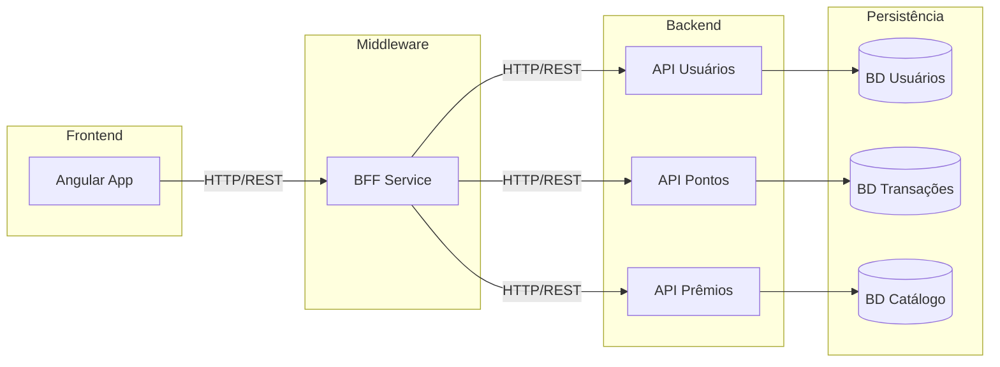

# Arquitetura do Sistema Loyalty Card

## Componentes Principais

### Frontend (Angular)
- Single Page Application desenvolvida em Angular
- Responsável pela interface do usuário para clientes e administradores
- Comunica-se exclusivamente com o BFF através de endpoints REST

### Backend for Frontend (BFF)
- Serviço intermediário em Node.js/Express
- Agrega dados de múltiplos serviços
- Simplifica a interface de comunicação para o frontend
- Implementa lógica específica para necessidades da UI

### APIs de Backend
1. **API de Usuários**: Gerencia dados de clientes, empresas e administradores
2. **API de Pontos**: Controla transações de pontos, saldos e históricos
3. **API de Prêmios**: Administra catálogo de prêmios e resgates

## Diagrama de Componentes

