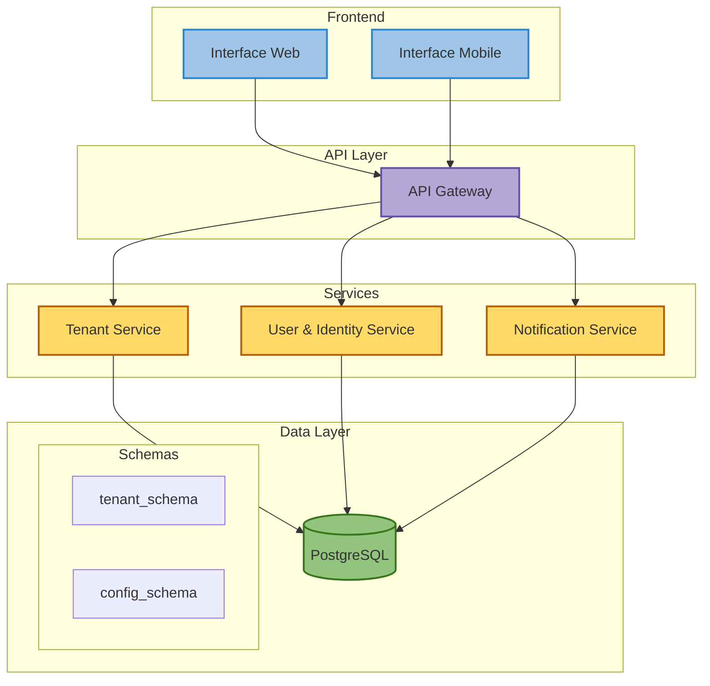

# Diagrama de Arquitetura - Visão Geral do MVP

```mermaid
flowchart TB
    subgraph "Frontend"
        FE[Interface Web]
        Mobile[Interface Mobile]
    end
    
    subgraph "API Layer"
        API[API Gateway]
    end
    
    subgraph "Services"
        TS[Tenant Service]
        UI[User & Identity Service]
        NS[Notification Service]
    end
    
    subgraph "Data Layer"
        DB[(PostgreSQL)]
        subgraph "Schemas"
            TenantSchema[tenant_schema]
            ConfigSchema[config_schema]
        end
    end
    
    FE --> API
    Mobile --> API
    
    API --> TS
    API --> UI
    API --> NS
    
    TS --> DB
    UI --> DB
    NS --> DB
    
    class TS,UI,NS service
    class API gateway
    class FE,Mobile frontend
    class DB database
    
    classDef frontend fill:#9FC5E8,stroke:#2986CC,stroke-width:2px
    classDef service fill:#FFD966,stroke:#B45F06,stroke-width:2px
    classDef gateway fill:#B4A7D6,stroke:#674EA7,stroke-width:2px
    classDef database fill:#93C47D,stroke:#38761D,stroke-width:2px
```
