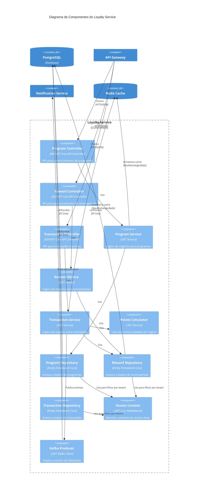

```mermaid
C4Component
    title Diagrama de Componentes do Loyalty Service
    
    Container_Boundary(loyaltyService, "Loyalty Service") {
        Component(programController, "Program Controller", "ASP.NET Core API Controller", "API para gerenciamento de programas")
        Component(rewardController, "Reward Controller", "ASP.NET Core API Controller", "API para gerenciamento de recompensas")
        Component(transactionController, "Transaction Controller", "ASP.NET Core API Controller", "API para transações e pontos")
        
        Component(programService, "Program Service", ".NET Service", "Lógica de negócio para programas")
        Component(rewardService, "Reward Service", ".NET Service", "Lógica de negócio para recompensas")
        Component(transactionService, "Transaction Service", ".NET Service", "Lógica de negócio para transações")
        Component(pointsCalculator, "Points Calculator", ".NET Service", "Calcula pontos baseado em regras")
        
        Component(programRepo, "Program Repository", "Entity Framework Core", "Acesso a dados de programas")
        Component(rewardRepo, "Reward Repository", "Entity Framework Core", "Acesso a dados de recompensas")
        Component(transactionRepo, "Transaction Repository", "Entity Framework Core", "Acesso a dados de transações")
        
        Component(tenantContext, "Tenant Context", ".NET Core Middleware", "Mantém contexto do tenant atual")
        Component(kafkaProducer, "Kafka Producer", ".NET Kafka Client", "Publica eventos de fidelidade")
    }
    
    ContainerDb(postgresDB, "PostgreSQL", "Database")
    Container(apiGateway, "API Gateway")
    Container(notificationService, "Notification Service")
    ContainerDb(redisCache, "Redis Cache")
    
    Rel(apiGateway, programController, "Chama", "HTTP/JSON")
    Rel(apiGateway, rewardController, "Chama", "HTTP/JSON")
    Rel(apiGateway, transactionController, "Chama", "HTTP/JSON")
    
    Rel(programController, programService, "Usa")
    Rel(rewardController, rewardService, "Usa")
    Rel(transactionController, transactionService, "Usa")
    
    Rel(programService, programRepo, "Usa")
    Rel(rewardService, rewardRepo, "Usa")
    Rel(transactionService, rewardRepo, "Usa")
    Rel(transactionService, pointsCalculator, "Usa")
    
    Rel(programRepo, postgresDB, "Lê/Escreve", "EF Core")
    Rel(rewardRepo, postgresDB, "Lê/Escreve", "EF Core")
    Rel(transactionRepo, postgresDB, "Lê/Escreve", "EF Core")
    
    Rel_D(programRepo, tenantContext, "Usa para filtrar por tenant")
    Rel_D(rewardRepo, tenantContext, "Usa para filtrar por tenant")
    Rel_D(transactionRepo, tenantContext, "Usa para filtrar por tenant")
    
    Rel(transactionService, kafkaProducer, "Publica eventos")
    Rel(kafkaProducer, notificationService, "Envia eventos para")
    
    Rel(programService, redisCache, "Armazena cache", "StackExchange.Redis")
    Rel(transactionService, redisCache, "Armazena cache", "StackExchange.Redis")
```