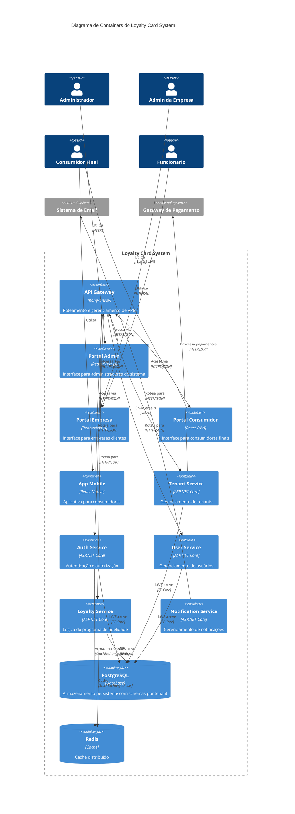

```mermaid
C4Container
    title Diagrama de Containers do Loyalty Card System
    
    System_Boundary(loyaltySystem, "Loyalty Card System") {
        Container(apiGateway, "API Gateway", "Kong/Envoy", "Roteamento e gerenciamento de APIs")
        
        Container(adminPortal, "Portal Admin", "React/Next.js", "Interface para administradores do sistema")
        Container(companyPortal, "Portal Empresa", "React/Next.js", "Interface para empresas clientes")
        Container(consumerPortal, "Portal Consumidor", "React PWA", "Interface para consumidores finais")
        Container(mobileApp, "App Mobile", "React Native", "Aplicativo para consumidores")
        
        Container(tenantService, "Tenant Service", "ASP.NET Core", "Gerenciamento de tenants")
        Container(authService, "Auth Service", "ASP.NET Core", "Autenticação e autorização")
        Container(userService, "User Service", "ASP.NET Core", "Gerenciamento de usuários")
        Container(loyaltyService, "Loyalty Service", "ASP.NET Core", "Lógica do programa de fidelidade")
        Container(notificationService, "Notification Service", "ASP.NET Core", "Gerenciamento de notificações")
        
        ContainerDb(postgresDB, "PostgreSQL", "Database", "Armazenamento persistente com schemas por tenant")
        ContainerDb(redisCache, "Redis", "Cache", "Cache distribuído")
    }
    
    Person(administrador, "Administrador")
    Person(companyAdmin, "Admin da Empresa")
    Person(consumidor, "Consumidor Final")
    Person(funcionario, "Funcionário")
    
    System_Ext(emailSystem, "Sistema de Email")
    System_Ext(paymentGateway, "Gateway de Pagamento")
    
    Rel(administrador, adminPortal, "Utiliza", "HTTPS")
    Rel(companyAdmin, companyPortal, "Utiliza", "HTTPS")
    Rel(consumidor, consumerPortal, "Utiliza", "HTTPS")
    Rel(consumidor, mobileApp, "Utiliza")
    Rel(funcionario, companyPortal, "Utiliza", "HTTPS")
    
    Rel(adminPortal, apiGateway, "Acessa via", "HTTPS/JSON")
    Rel(companyPortal, apiGateway, "Acessa via", "HTTPS/JSON")
    Rel(consumerPortal, apiGateway, "Acessa via", "HTTPS/JSON")
    Rel(mobileApp, apiGateway, "Acessa via", "HTTPS/JSON")
    
    Rel(apiGateway, tenantService, "Roteia para", "HTTP/JSON")
    Rel(apiGateway, authService, "Roteia para", "HTTP/JSON")
    Rel(apiGateway, userService, "Roteia para", "HTTP/JSON")
    Rel(apiGateway, loyaltyService, "Roteia para", "HTTP/JSON")
    
    Rel(tenantService, postgresDB, "Lê/Escreve", "EF Core")
    Rel(authService, postgresDB, "Lê/Escreve", "EF Core")
    Rel(userService, postgresDB, "Lê/Escreve", "EF Core")
    Rel(loyaltyService, postgresDB, "Lê/Escreve", "EF Core")
    
    Rel(authService, redisCache, "Armazena sessões", "StackExchange.Redis")
    Rel(loyaltyService, redisCache, "Cache", "StackExchange.Redis")
    
    Rel(notificationService, emailSystem, "Envia emails", "SMTP")
    Rel(tenantService, paymentGateway, "Processa pagamentos", "HTTPS/API")
```