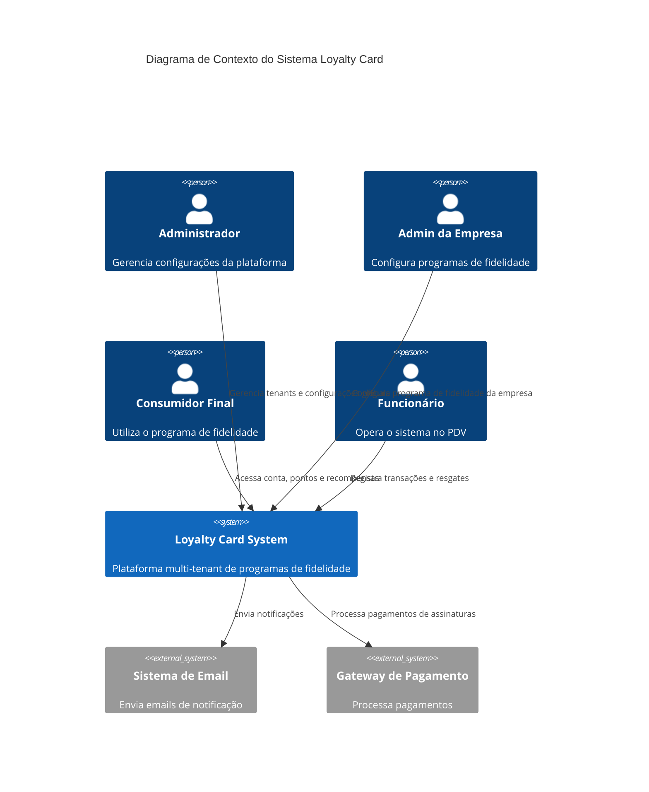

```mermaid

C4Context
    title Diagrama de Contexto do Sistema Loyalty Card
    
    Person(administrador, "Administrador", "Gerencia configurações da plataforma")
    Person(companyAdmin, "Admin da Empresa", "Configura programas de fidelidade")
    Person(consumidor, "Consumidor Final", "Utiliza o programa de fidelidade")
    Person(funcionario, "Funcionário", "Opera o sistema no PDV")
    
    System(loyaltySystem, "Loyalty Card System", "Plataforma multi-tenant de programas de fidelidade")
    
    System_Ext(emailSystem, "Sistema de Email", "Envia emails de notificação")
    System_Ext(paymentGateway, "Gateway de Pagamento", "Processa pagamentos")
    
    Rel(administrador, loyaltySystem, "Gerencia tenants e configurações globais")
    Rel(companyAdmin, loyaltySystem, "Configura programa de fidelidade da empresa")
    Rel(consumidor, loyaltySystem, "Acessa conta, pontos e recompensas")
    Rel(funcionario, loyaltySystem, "Registra transações e resgates")
    
    Rel(loyaltySystem, emailSystem, "Envia notificações")
    Rel(loyaltySystem, paymentGateway, "Processa pagamentos de assinaturas")
```