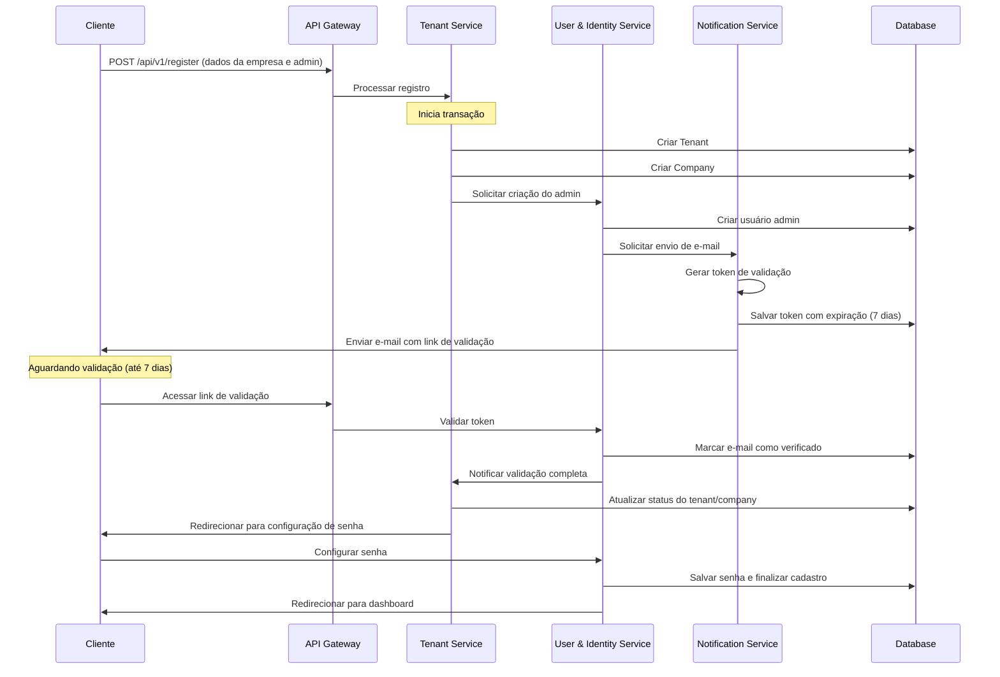

# Diagrama de Sequência - Processo de Onboarding

O diagrama abaixo ilustra as interações entre os diferentes componentes do sistema durante o processo de onboarding de um novo cliente, desde o registro inicial até a ativação completa.

## Interações Principais

1. **Registro Inicial**
   - Cliente submete formulário com dados da empresa e administrador
   - Tenant Service coordena a criação das entidades básicas

2. **Envio de Validação**
   - Notification Service gera token e envia email
   - Token tem validade de 7 dias conforme ADR-001

3. **Validação de Email**
   - Cliente acessa link enviado por email
   - User Service valida o token e atualiza o status

4. **Finalização do Cadastro**
   - Cliente configura senha definitiva
   - Sistema ativa o tenant/company e libera acesso

## Considerações

- Este fluxo implementa a decisão de validação por Callback URL conforme ADR-001
- A comunicação entre serviços é síncrona para o MVP
- As falhas em qualquer etapa são registradas para análise manual
