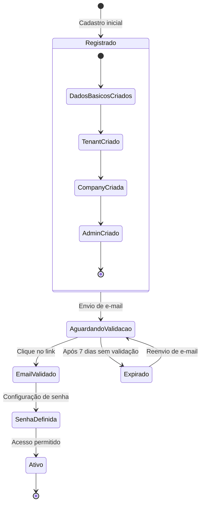

# Diagrama de Estado - Processo de Onboarding

O diagrama abaixo ilustra os diferentes estados pelos quais um tenant/company passa durante o processo de onboarding, desde o registro inicial até a ativação completa.

## Estados Principais

### 1. Registrado
Estado inicial após o envio do formulário de cadastro, onde os dados básicos foram coletados e as entidades iniciais foram criadas no sistema.

### 2. AguardandoValidacao
Estado onde o sistema aguarda que o usuário valide seu email através do link enviado.

### 3. EmailValidado
Estado alcançado após a validação bem-sucedida do email do administrador.

### 4. SenhaDefinida
Estado onde o usuário já validou o email e definiu sua senha de acesso.

### 5. Ativo
Estado final do processo de onboarding, onde o tenant está completamente configurado e ativo.

### 6. Expirado
Estado de falha que ocorre quando o token de validação não é utilizado dentro do período de 7 dias.

## Sub-estados do Registro

O estado "Registrado" é composto por uma sequência de sub-estados que representam a criação das entidades necessárias:

1. DadosBasicosCriados
2. TenantCriado
3. CompanyCriada
4. AdminCriado

## Transições Importantes

- A transição de **AguardandoValidacao** para **Expirado** ocorre automaticamente após 7 dias
- A transição de **Expirado** para **AguardandoValidacao** ocorre quando o usuário solicita o reenvio do email
- A transição para **Ativo** só ocorre após a definição de senha, completando o processo de onboarding
