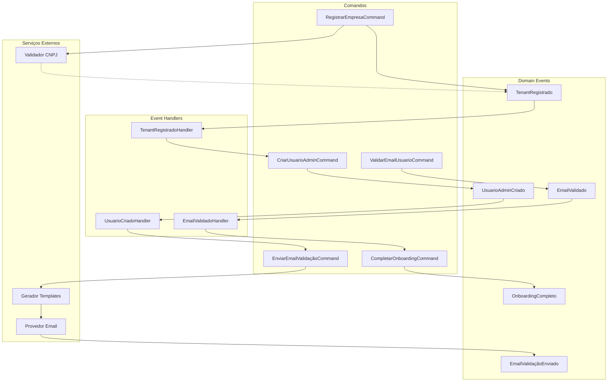

# Fluxo de Eventos e Comandos - Onboarding

```mermaid
flowchart TD
    subgraph "Comandos"
        C1[RegistrarEmpresaCommand]
        C2[CriarUsuarioAdminCommand]
        C3[EnviarEmailValidaçãoCommand]
        C4[ValidarEmailUsuarioCommand]
        C5[CompletarOnboardingCommand]
    end
    
    subgraph "Event Handlers"
        EH1[TenantRegistradoHandler]
        EH2[UsuarioCriadoHandler]
        EH3[EmailValidadoHandler]
    end
    
    subgraph "Domain Events"
        E1[TenantRegistrado]
        E2[UsuarioAdminCriado]
        E3[EmailValidaçãoEnviado]
        E4[EmailValidado]
        E5[OnboardingCompleto]
    end
    
    subgraph "Serviços Externos"
        S1[Validador CNPJ]
        S2[Provedor Email]
        S3[Gerador Templates]
    end
    
    C1 --> E1
    E1 --> EH1
    EH1 --> C2
    C2 --> E2
    E2 --> EH2
    EH2 --> C3
    C3 --> S3
    S3 --> S2
    S2 --> E3
    C1 --> S1
    S1 -.-> E1
    C4 --> E4
    E4 --> EH3
    EH3 --> C5
    C5 --> E5

```