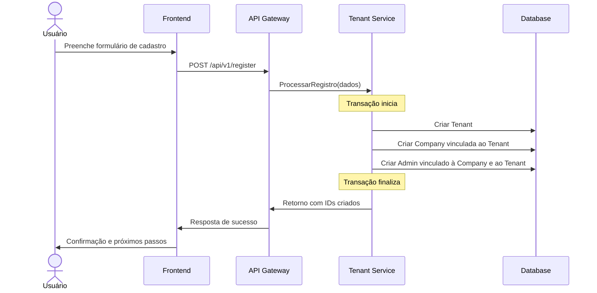

# Fluxo Completo de Onboarding

## Visão Geral do Processo

O processo de onboarding segue uma estrutura hierárquica onde primeiro é criado o tenant e depois as companies associadas a ele. Entretanto, para simplificar a experiência do usuário, ambas as operações acontecem de maneira transparente durante o cadastro inicial.

## Fluxo de Cadastro do MVP

### Abordagem 1: Criação Implícita do Tenant (Recomendada para MVP)

1. **Início do Cadastro**
   - Usuário acessa a página de cadastro de empresa
   - Preenche os dados da empresa (razão social, CNPJ, etc.)
   - Preenche seus dados pessoais como administrador

2. **Processamento Interno no Backend**
   - O sistema automaticamente cria um tenant com o mesmo nome da empresa
   - O tenant recebe um identificador único (TenantId)
   - A empresa é criada e vinculada ao tenant criado
   - O usuário administrador é associado à empresa e ao tenant

3. **Confirmação e Validação**
   - Email de confirmação é enviado ao administrador
   - Após validação, tanto o tenant quanto a company ficam ativos

### Abordagem 2: Processo em Duas Etapas (Para Implementação Futura)

1. **Criação do Tenant**
   - Usuário informa nome do grupo/organização (tenant)
   - Sistema cria o tenant e um usuário super-admin
   - Validação do email do super-admin

2. **Criação da Primeira Company**
   - Após validação, super-admin é direcionado para cadastrar a primeira empresa
   - Informações da empresa são coletadas e associadas ao tenant
   - Empresa fica disponível após validação de CNPJ (se aplicável)

3. **Criação de Outras Companies (opcional)**
   - Super-admin pode adicionar mais empresas ao mesmo tenant

## Diagrama do Fluxo para MVP

## Implementação Técnica

### Para o MVP

Para simplificar o processo de onboarding no MVP, recomendamos a abordagem 1 (criação implícita do tenant), onde:

- A API de registro processa um único formulário
- O backend automaticamente cria as estruturas de tenant e company
- O usuário percebe apenas que está cadastrando sua empresa

Isto permite uma experiência mais fluida para o usuário enquanto mantemos a arquitetura correta no backend, com tenant e company separados.

### Evolução Futura

À medida que o produto evolui, podemos migrar para a abordagem 2 (processo em duas etapas), especialmente para clientes corporativos que precisam gerenciar múltiplas empresas sob um mesmo tenant.

## Considerações de UX

- No MVP, ocultar a complexidade de tenants do usuário final
- A tela de cadastro deve focar nos dados da empresa
- Termos como "tenant" e "multi-tenancy" não devem aparecer na interface
- Manter as mensagens voltadas para "cadastro da sua empresa" em vez de termos técnicos
