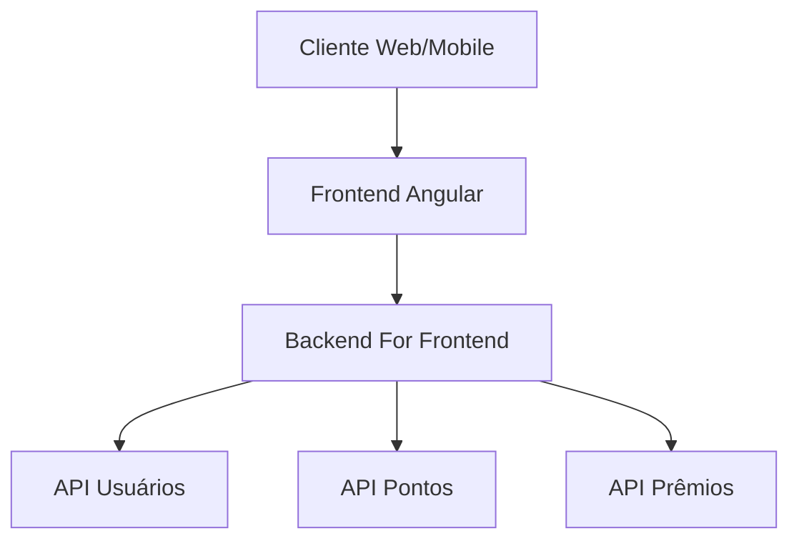

# Sistema Loyalty Card

## Visão Geral

O sistema Loyalty Card é uma plataforma de fidelidade que permite empresas gerenciarem programas de pontos para seus clientes. O sistema é composto por:

- **Frontend Angular**: Interface de usuário para clientes e administradores
- **Backend for Frontend (BFF)**: Camada intermediária que simplifica as requisições do frontend
- **APIs específicas**: Serviços especializados para diferentes domínios do negócio

## Documentação

- [Arquitetura](architecture.md) - Detalhes sobre a arquitetura da aplicação
- [Comunicação entre APIs](api-flows.md) - Fluxos de comunicação entre componentes
- [Guia de Desenvolvimento](development-guide.md) - Instruções para desenvolvedores

## Diagrama Geral

## Especificações Técnicas

| Componente | Tecnologia | Infraestrutura |
|------------|------------|----------------|
| Frontend   | Angular 14 | Netlify/Vercel |
| BFF        | Node.js/Express | Containeres em Azure |
| APIs       | ASP.NET Core | Kubernetes em Azure |
| Banco de Dados | PostgreSQL | Azure Database |

# Loyalty Card - Documentação

Bem-vindo à documentação do projeto Loyalty Card. Esta documentação fornece informações detalhadas sobre o sistema de cartão de fidelidade.

## Sobre o Projeto

O Loyalty Card é um sistema que permite empresas oferecerem programas de fidelidade aos seus clientes, recompensando-os por compras recorrentes e aumentando a retenção de clientes.

## Conteúdo da Documentação

- [Guia de Início Rápido](getting-started/quick-start.md)
- [Arquitetura do Sistema](architecture/)
  - [Registros de Decisões de Arquitetura (ADRs)](architecture/adrs/)
- [API Reference](api/reference.md)
- [Guia do Usuário](user-guide/introduction.md)
- [Propostas de Mudanças (RFCs)](rfcs/)
- [FAQ](faq/common-questions.md)

## Contribuindo com o Projeto

- [Guia de Contribuição](contributing/guide.md)
- [Processo de ADRs](contributing/adrs.md)
- [Processo de RFCs](contributing/rfcs.md)
- [Padrões de Código](contributing/code-standards.md)

## Links Úteis

- [Repositório do Projeto](https://github.com/seu-usuario/loyalty-card)
- [Reportar um Bug](https://github.com/seu-usuario/loyalty-card/issues/new)