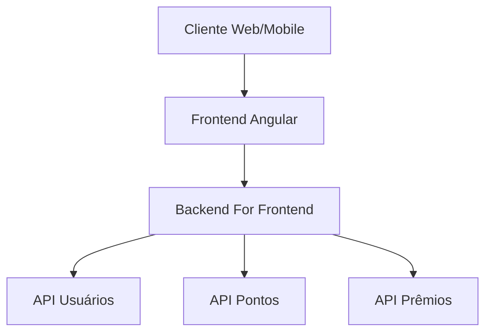

# Sistema Loyalty Card

## Visão Geral

O sistema Loyalty Card é uma plataforma de fidelidade que permite empresas gerenciarem programas de pontos para seus clientes. O sistema é composto por:

- **Frontend Angular**: Interface de usuário para clientes e administradores
- **Backend for Frontend (BFF)**: Camada intermediária que simplifica as requisições do frontend
- **APIs específicas**: Serviços especializados para diferentes domínios do negócio

## Documentação

- [Arquitetura](architecture.md) - Detalhes sobre a arquitetura da aplicação
- [Comunicação entre APIs](api-flows.md) - Fluxos de comunicação entre componentes
- [Guia de Desenvolvimento](development-guide.md) - Instruções para desenvolvedores

## Diagrama Geral

## Especificações Técnicas

| Componente | Tecnologia | Infraestrutura |
|------------|------------|----------------|
| Frontend   | Angular 14 | Netlify/Vercel |
| BFF        | Node.js/Express | Containeres em Azure |
| APIs       | ASP.NET Core | Kubernetes em Azure |
| Banco de Dados | PostgreSQL | Azure Database |