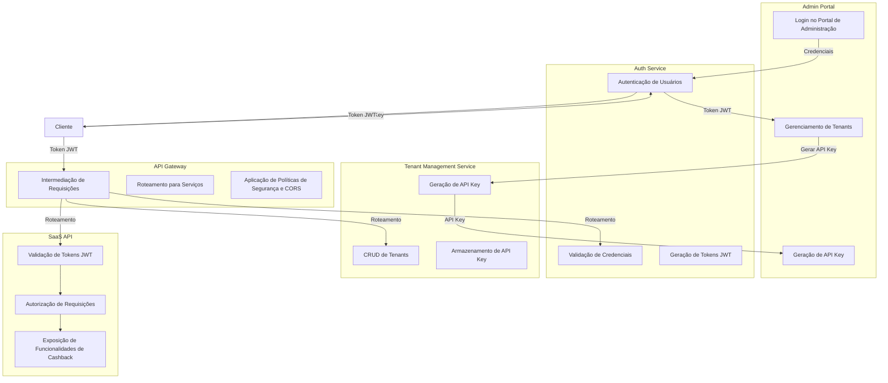

```mermaid

flowchart TD
    subgraph Admin Portal
        A1[Login no Portal de Administração]
        A2[Gerenciamento de Tenants]
        A3[Geração de API Key]
    end
    
    subgraph Auth Service
        B1[Autenticação de Usuários]
        B2[Validação de Credenciais]
        B3[Geração de Tokens JWT]
    end
    
    subgraph Tenant Management Service
        C1[CRUD de Tenants]
        C2[Geração de API Key]
        C3[Armazenamento de API Key]
    end
    
    subgraph SaaS API
        D1[Validação de Tokens JWT]
        D2[Autorização de Requisições]
        D3[Exposição de Funcionalidades de Cashback]
    end
    
    subgraph API Gateway
        E1[Intermediação de Requisições]
        E2[Roteamento para Serviços]
        E3[Aplicação de Políticas de Segurança e CORS]
    end
    
    A1 -->|Credenciais| B1
    B1 -->|Token JWT| A2
    A2 -->|Gerar API Key| C2
    C2 -->|API Key| A3
    Cliente -->|API Key| B1
    B1 -->|Token JWT| Cliente
    Cliente -->|Token JWT| E1
    E1 -->|Roteamento| D1
    D1 --> D2
    D2 --> D3
    E1 -->|Roteamento| C1
    E1 -->|Roteamento| B2

```