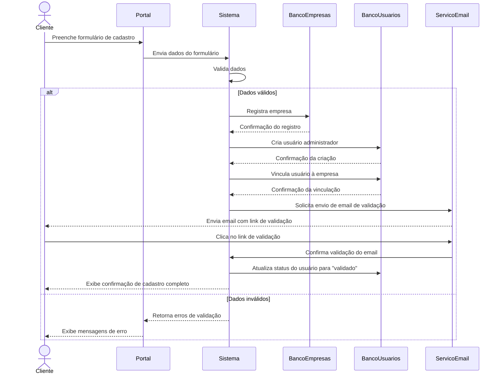

# Diagrama de Sequência para Onboarding de Cliente

```mermaid
sequenceDiagram
    actor Cliente
    participant Portal
    participant Sistema
    participant BancoEmpresas
    participant BancoUsuarios
    participant ServicoEmail

    Cliente->>Portal: Preenche formulário de cadastro
    Portal->>Sistema: Envia dados do formulário
    Sistema->>Sistema: Valida dados
    
    alt Dados válidos
        Sistema->>BancoEmpresas: Registra empresa
        BancoEmpresas-->>Sistema: Confirmação do registro
        
        Sistema->>BancoUsuarios: Cria usuário administrador
        BancoUsuarios-->>Sistema: Confirmação da criação
        
        Sistema->>BancoUsuarios: Vincula usuário à empresa
        BancoUsuarios-->>Sistema: Confirmação da vinculação
        
        Sistema->>ServicoEmail: Solicita envio de email de validação
        ServicoEmail-->>Cliente: Envia email com link de validação
        
        Cliente->>ServicoEmail: Clica no link de validação
        ServicoEmail->>Sistema: Confirma validação do email
        Sistema->>BancoUsuarios: Atualiza status do usuário para "validado"
        Sistema-->>Cliente: Exibe confirmação de cadastro completo
    else Dados inválidos
        Sistema-->>Portal: Retorna erros de validação
        Portal-->>Cliente: Exibe mensagens de erro
    end
```